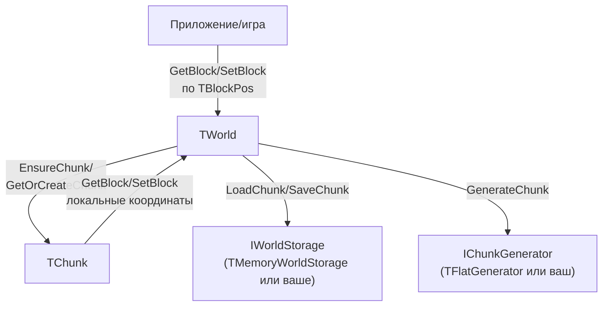

## Архитектура CubeWorld

Этот документ описывает, как библиотека устроена внутри и как данные проходят через её слои.

### Обзор модулей

- `cw_types.pas` — базовые типы: блоки, координаты, размеры чанка.
- `cw_chunk.pas` — класс `TChunk`, хранит блоки чанка в памяти.
- `cw_events.pas` — тип события `TChunkEvent` (создание/изменение чанка).
- `cw_storage_intf.pas` — интерфейс хранилища мира `IWorldStorage`.
- `cw_storage_mem.pas` — простое in‑memory хранилище `TMemoryWorldStorage`.
- `cw_generator_intf.pas` — интерфейс генератора чанков `IChunkGenerator`.
- `cw_generator_flat.pas` — простой генератор плоского мира `TFlatGenerator`.
- `cw_world.pas` — класс `TWorld`, управляющий всеми чанками и блоками.
- `cuboworld.pas` — фасад, реэкспортирующий публичное API (типы и классы).

### Модель данных

#### Блоки и координаты (`cw_types.pas`)

- `TBlockId` — целочисленный идентификатор типа блока (камень, земля, воздух и т.п.).
- `TBlock` — структура блока, сейчас содержит только `Id`, но может быть расширена (свет, метаданные).
- `TChunkCoord (X,Y,Z)` — координаты чанка в мире.
- `TBlockPos (X,Y,Z)` — глобальные координаты блока.
- Размеры чанка фиксированы константами `CChunkSizeX/Y/Z` (по умолчанию 16×16×16).

#### Чанк (`cw_chunk.pas`)

`TChunk` держит трёхмерный массив:

- `FBlocks[0..CChunkSizeX-1, 0..CChunkSizeY-1, 0..CChunkSizeZ-1]` — блоки.
- `Dirty: Boolean` — флаг, что чанк изменён (полезно для сохранения/перегенерации).

Методы:

- `GetBlock/SetBlock(AX, AY, AZ)` — доступ к блоку по локальным координатам (внутри чанка).
- `Clear(ABlock)` — заполнение чанка одним блоком (например, воздухом).

### Хранилище мира

#### Интерфейс (`cw_storage_intf.pas`)

`IWorldStorage` абстрагирует способ хранения чанков:

- `LoadChunk(ACoord, AChunk): Boolean` — попытка загрузки чанка в переданный `AChunk`.
  - Возвращает `True`, если данные найдены и загружены.
  - Возвращает `False`, если данных нет (тогда управление может перейти к генератору).
- `SaveChunk(ACoord, AChunk)` — сохранение чанка.
- `MarkChunkDirty(ACoord)` — пометка чанка как изменённого (стратегия сохранения зависит от реализации).

#### In‑memory реализация (`cw_storage_mem.pas`)

`TMemoryWorldStorage` — простая реализация для примеров и тестов:

- Использует `TStringList` как карту `"x:y:z" -> TChunk`.
- При `LoadChunk`:
  - ищет чанк по ключу,
  - копирует все блоки из сохранённого чанка в переданный `AChunk`.
- При `SaveChunk`:
  - создаёт или находит `Stored: TChunk`,
  - копирует в него все блоки из `AChunk`.
- `MarkChunkDirty` устанавливает флаг `Dirty` у сохранённого чанка.

Эта реализация не использует диск; вы можете написать собственную на основе файлов или БД, реализовав `IWorldStorage`.

### Генерация мира

#### Интерфейс (`cw_generator_intf.pas`)

`IChunkGenerator` описывает процедурный генератор:

- `GenerateChunk(ACoord, AChunk)` — заполнить переданный чанк содержимым, исходя из его координаты.

#### Плоский генератор (`cw_generator_flat.pas`)

`TFlatGenerator` реализует простой мир:

- Параметры:
  - `FGroundHeight` — высота «земли» в глобальных координатах (например, 4).
  - `FGroundBlock.Id` — тип блока для земли.
- При генерации:
  - вычисляет глобальную высоту `GlobalY` для каждой клетки чанка,
  - если `GlobalY < FGroundHeight` — ставит блок земли,
  - иначе — воздух (`Id = 0`).

### Управление миром (`cw_world.pas`)

`TWorld` — основной класс для работы приложения/движка.

Внутреннее состояние:

- `FChunks: TStringList` — карта `"x:y:z" -> TChunk` для уже существующих чанков.
- `FStorage: IWorldStorage` — источник/приёмник данных чанков (может быть `nil`).
- `FGenerator: IChunkGenerator` — генератор нового содержимого (может быть `nil`).
- `OnChunkCreated`, `OnChunkChanged` — события для интеграции с рендером и логикой.

#### Создание `TWorld`

```pascal
World := TWorld.Create(Storage, Generator);
```

- `Storage` — реализация `IWorldStorage` (например, `TMemoryWorldStorage`).
- `Generator` — реализация `IChunkGenerator` (например, `TFlatGenerator`).
- В конструкторе инициализируется отсортированный `TStringList` для хранения чанков.

#### Жизненный цикл чанка

1. **Запрос чанка**:
   - Через `EnsureChunk(ChunkCoord)` или косвенно через `SetBlock`.
2. **Поиск в памяти**:
   - Если чанк есть в `FChunks` — возвращается существующий.
3. **Если нет — создание нового**:
   - Создаётся `TChunk` и заполняется воздухом.
4. **Попытка загрузки**:
   - Если `FStorage` задан, вызывается `FStorage.LoadChunk(ACoord, Chunk)`.
   - Если чанк найден в хранилище — берём его содержимое.
5. **Если в хранилище нет — генерация**:
   - Если `FGenerator` задан, вызывается `FGenerator.GenerateChunk(ACoord, Chunk)`.
6. **Регистрация и событие**:
   - Чанк добавляется в `FChunks`.
   - Если есть обработчик `OnChunkCreated`, он вызывается.

#### Работа с блоками по глобальным координатам

**Чтение**: `GetBlock(APos: TBlockPos): TBlock`

- Координаты блока преобразуются:
  - в координаты чанка (`X div CChunkSizeX`, и т.д.),
  - и локальные координаты внутри чанка (`X mod CChunkSizeX`).
- Используется `TryGetChunk`:
  - если чанк не найден в памяти, возвращается «воздух» (`Id = 0`), ничего не создаётся.
- Если чанк есть — возвращается соответствующий блок из `TChunk`.

**Запись**: `SetBlock(APos: TBlockPos; ABlock: TBlock)`

- Аналогично вычисляются координаты чанка и локальные координаты.
- Вызывается `GetOrCreateChunk`:
  - чанк создаётся/загружается/генерируется по описанному выше сценарию.
- В чанк записывается блок.
- Если есть `FStorage`, вызывается `MarkChunkDirty`.
- Если есть обработчик `OnChunkChanged`, он вызывается.

### Фасадное API (`cuboworld.pas`)

`cuboworld.pas` облегчает использование библиотеки:

- В разделе `uses` подключает все внутренние модули (`cw_*`).
- В разделе `type` объявляет алиасы:
  - `TWorld = cw_world.TWorld;`
  - `TBlock = cw_types.TBlock;`
  - `TBlockPos = cw_types.TBlockPos;`
  - `IWorldStorage = cw_storage_intf.IWorldStorage;`
  - `TMemoryWorldStorage = cw_storage_mem.TMemoryWorldStorage;`
  - `IChunkGenerator = cw_generator_intf.IChunkGenerator;`
  - `TFlatGenerator = cw_generator_flat.TFlatGenerator;`

Внешний код видит только единый модуль `cuboworld` и не зависит напрямую от внутренних имён юнитов.

### Схема потоков данных



Ключевая идея: `TWorld` — единственная точка входа, которая координирует память (`TChunk`), хранилище (`IWorldStorage`) и генерацию (`IChunkGenerator`). Движок или игра работают только с глобальными координатами и типами из `cuboworld`.

### См. также

- [chunks_and_blocks.md](chunks_and_blocks.md) — как управляются чанки и блоки (когда чанк создаётся, полный/неполный чанк, разреженность мира).

